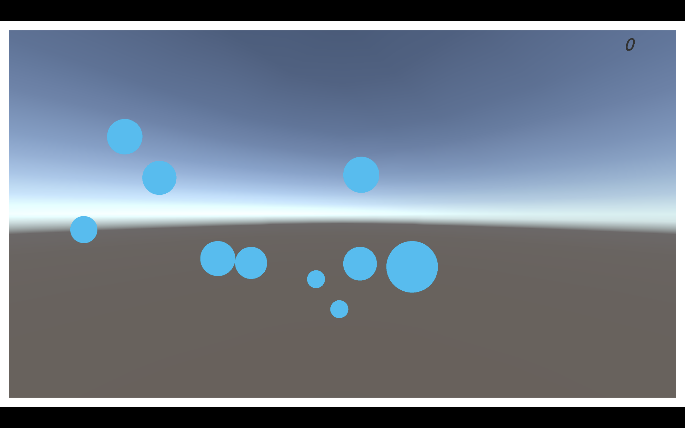

# CodeLab1-yl7113-HW1
CodeLab 1 - Classwork

 
> Screen Shot of the game

## Intro
This is a simple game where people can control the drops on a surface and let them merge. The larger a drop is, the fater it will move. When a larger drop hits a smaller drop, the former one will become larger, and the player will get scores related to the size of smaller drop. When there's only one drop left, game ends.

## Score System
As is mentioned the score players get only related to the size of the smaller drop hitted by the larger drop. Meanwhile, the scale a drop grows up by "eating" smaller drops is greater than the scores got from them. Which means that if you let a medium drop "eat" a smaller drop before a larger one "eat" it, you will get more scores than eating them separately.

## WIP
- The game is meant to be implemented on mobile phone, but still working on the building issue of Unity with iOS.
